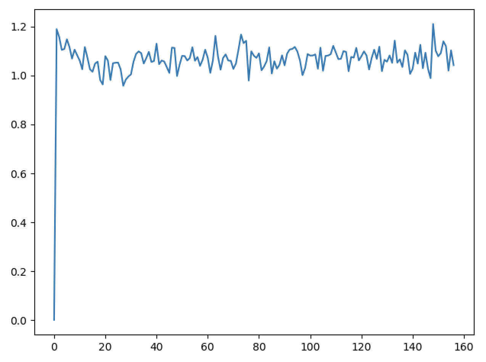
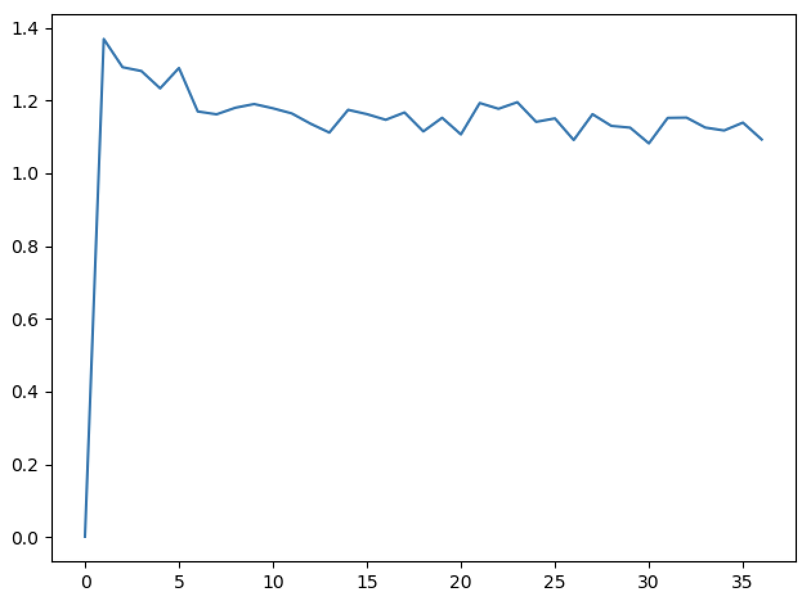
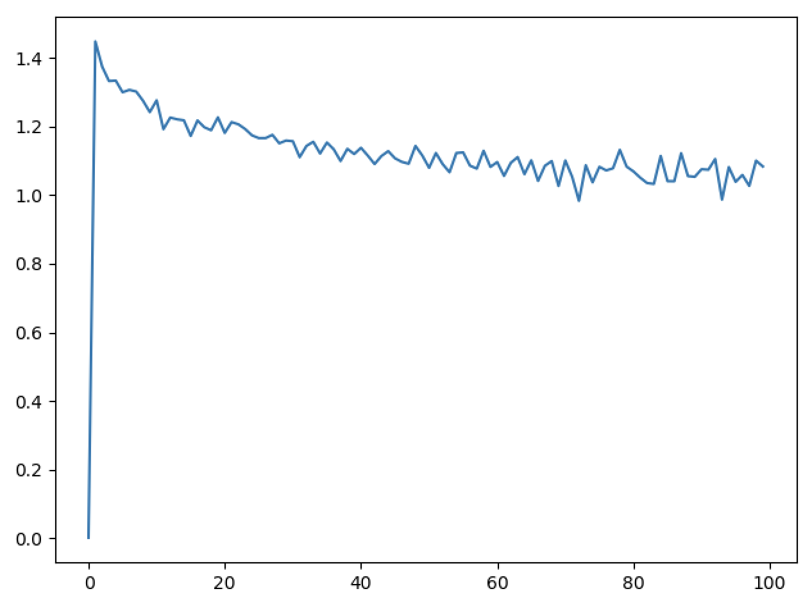

### 任务二：基于深度学习的文本分类

用Pytorch重写《任务一》，实现CNN、RNN的文本分类

1. 参考论文

   1. Convolutional Neural Networks for Sentence Classification <https://arxiv.org/abs/1408.5882>
   2. <https://machinelearningmastery.com/sequence-classification-lstm-recurrent-neural-networks-python-keras/>

2. word embedding 的方式初始化

3. 随机embedding的初始化方式

4. 用glove 预训练的embedding进行初始化 https://nlp.stanford.edu/projects/glove/

5. 知识点：

   1. [卷积神经网络](<https://jesseyule.github.io/machinelearning/cnn/content.html>)
   2. [循环神经网络](<https://jesseyule.github.io/machinelearning/rnn/content.html>)
   3. [word2vec](<https://jesseyule.github.io/naturallanguage/word2vec/content.html>)
   4. [GloVe](<https://jesseyule.github.io/naturallanguage/gloVe/content.html>)

   

### 代码说明

​	1.textClassificationWithRNN.py是利用Pytorch在文本分类中应用RNN的简单例子，2.GloVe.py说明了如何使用GloVe的预训练词向量，3.textClassificationWithCNN.py则是使用Tensorflow将CNN应用到文本分类中。

​	3.textClassificationWithRNNAndGlove.py主要基于1和2两段代码，利用GloVe对原始数据进行转换，在输入到RNN中进行分析。在改写的过程中，主要需要注意的是数据格式，因为pytorch对输入数据的格式有很严格的要求（比如数据的维数），所以必须检查清楚避免出错，建议在理解第一第二个文件的代码的基础上，自行改写出第三个文件。

### 结果分析

 

​	这是第一次训练的结果，从结果可以看出，其实模型训练效果并不算好，主要原因有以下几点：

1. 模型是按顺序训练数据，实际上应该进行随机抽取数据进行训练

2. 模型只有一层隐层，这也可能导致模型训练效果欠缺

3. GloVe缺失部分词向量，对这些词向量模型里都以全0向量代替，对模型的结果也可能造成影响

   第二次训练我才用了随机选取数据进行训练，效果马上就上来了：

​	可是另一个问题又来了，模型的输出出现NAN，在网上搜索之后发现可能是梯度爆炸（消失？）造成的，于是把学习率降低，再学习一次：

​	第三次的训练效果是比较满意的，也避免了梯度爆炸的问题。

​	基于上面的训练过程，可以看出随机训练模型对模型的学习非常重要。结合训练数据其实可以这样理解，我们按顺序训练数据，模型"学到"了这一批数据的规律，应用到下一批数据又不凑效了，所以模型的Loss没有明显的下降，但是随机学习数据的话，就避免了这个问题。从这个角度来说，所谓的学习对机器来说，或许本质上还是"记住"数据的潜在规律。