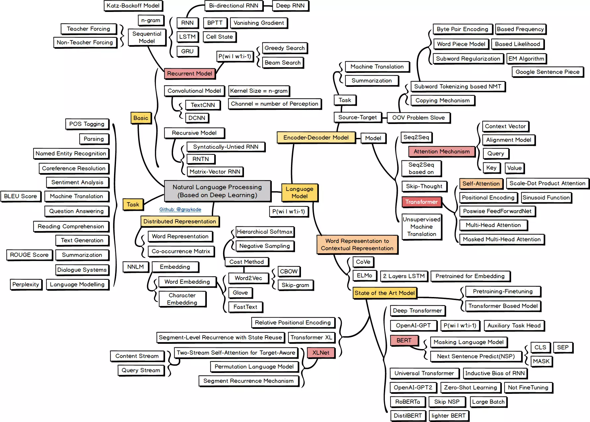

# NLPBeginner
本项目主要针对有机器学习基础、想入门自然语言处理的朋友，主要基于<https://github.com/FudanNLP/nlp-beginner>进行拓展补充。

主要涵盖了自然语言处理中比较基础的文本分类、文本匹配、序列标注等问题以及相关基础模型，可按照顺序进行学习。

直接运行代码可能会因为数据存储文件路径不同而报错，要根据你的实际情况修改路径，部分数据太大这里没有提供源文件。

在学习本项目之前，需掌握：

1. python基础：包括numpy、pandas、matplotlib等package，pytorch和tensorflow这两个深度学习框架。
2. 机器学习和深度模型：最起码要深入了解线性回归、logistic回归、CNN、RNN、LSTM

### 学习路线（相关知识点）

1. 基于logistic回归的文本分类：

   * [词袋模型](https://jesseyule.github.io/naturallanguage/bow/content.html)
   * [logistic回归](https://jesseyule.github.io/machinelearning/logisticRegression/content.html)
2. 基于深度学习的文本分类：

   * [卷积神经网络](<https://jesseyule.github.io/machinelearning/cnn/content.html>)
   * [循环神经网络](<https://jesseyule.github.io/machinelearning/rnn/content.html>)
   * [word2vec](<https://jesseyule.github.io/naturallanguage/word2vec/content.html>)
   * [GloVe](<https://jesseyule.github.io/naturallanguage/gloVe/content.html>)
3. 基于注意力机制的文本匹配
   * [LSTM](<https://jesseyule.github.io/machinelearning/lstm/content.html>)
   * [seq2seq](<https://jesseyule.github.io/naturallanguage/seq2seq/content.html>)
   * [注意力机制](<https://jesseyule.github.io/naturallanguage/attentionMechanism/content.html>)
   * [ESIM](<https://jesseyule.github.io/naturallanguage/ESIM/content.html>)
4. 基于LSTM+CRF的命名实体识别
   - [概率图模型](<https://jesseyule.github.io/naturallanguage/probabilistifcGraphicalModel/content.html>)
   - [隐马尔可夫模型](<https://jesseyule.github.io/naturallanguage/hmm/content.html>)
   - [Viterbi算法](<https://jesseyule.github.io/naturallanguage/viterbi/content.html>)
   - [条件随机场](<https://jesseyule.github.io/naturallanguage/crf/content.html>)
5. 构建一个Transformer
   * [self attention](<https://jesseyule.github.io/naturallanguage/selfAttention/content.html>)
   * [transformer](<https://jesseyule.github.io/naturallanguage/transformer/content.html>)

最后放一张自然语言领域目前的学习路线图，当然其实每年都有很多新技术新模型出现，知识永远都是学不完的，祝愿各位、也希望自己能保持热爱，在这个领域能做出一点贡献。

